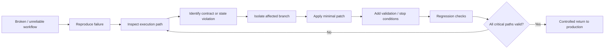

# n8n Workflow Rescue — Portfolio Showcase

> **Portfolio showcase only.** This repository documents the troubleshooting and recovery methodology used on real n8n / AI automation systems. It intentionally does **not** contain production workflow exports, credentials, endpoints, provider IDs, prompts, customer data, or proprietary orchestration logic.

## What this project demonstrates

Building an automation is only part of the job. Production workflows eventually fail because APIs change, payloads drift, assets are missing, retries duplicate work, fallback logic becomes unsafe, or a local fix breaks another branch of the workflow.

This case study focuses on **repairing existing n8n systems without damaging working functionality**.

### Capabilities demonstrated

- n8n workflow debugging
- production failure triage
- API contract validation
- payload and schema troubleshooting
- execution-path analysis
- guardrail and stop-condition design
- safe fallback removal
- media / file-state validation
- retry and idempotency thinking
- cost-protection logic
- regression testing
- surgical workflow patching
- human approval gates
- recovery without full rebuild

## High-level rescue process

## Typical failure classes addressed

### API contract drift

An external service may accept a different payload, authentication method, model identifier, or parameter set than the workflow expects.

The safe response is to validate the real provider contract before changing production logic.

### Unsafe fallback

Fallbacks are useful only when the substitute output is truly equivalent. In media and AI workflows, silently replacing a missing segment or asset with a master file can create incorrect output and unexpected cost.

The safer pattern is often **fail closed**: stop the branch, explain the invalid state, and require a valid replacement.

### Partial-state inconsistency

Multi-stage workflows can hold valid data in one stage and stale or incomplete data in another. Rescue work must verify the contract between stages, not only the failing node.

### Expensive regeneration

AI generation workflows can consume paid credits. A repair must distinguish between recoverable state and work that genuinely needs regeneration.

### Regression risk

A patch is not complete when the immediate error disappears. The surrounding modes and branches must still behave correctly.

## My role

**n8n / AI Automation Troubleshooter & Solution Designer**

My work includes:

- tracing failed executions;
- checking assumptions between nodes;
- validating external API behaviour;
- identifying unsafe fallbacks;
- adding explicit stop conditions;
- preserving working branches;
- testing the patched path against related modes;
- documenting the technical delivery boundary before production use.

## Engineering principles

1. **Reproduce before modifying**
2. **Patch the smallest possible surface**
3. **Validate external contracts instead of guessing**
4. **Fail closed when fallback would create incorrect output**
5. **Protect paid API usage**
6. **Preserve valid state whenever possible**
7. **Test neighbouring execution paths**
8. **Do not certify a fix until the persisted workflow is verified**

## What is intentionally not public

- production n8n workflow JSON
- workflow IDs
- webhook URLs
- API keys or credential references
- server addresses
- provider-specific asset IDs
- proprietary prompts
- production node names
- exact payloads
- internal state schemas
- customer data
- commercial cost formulas
- complete retry / routing logic
- private regression procedures

## Commercial use

This repository is a professional case study, not a downloadable repair template.

The same rescue methodology is applicable to:

- broken n8n workflows;
- AI API integrations;
- webhook automations;
- CRM / lead pipelines;
- media automation;
- multi-provider workflows;
- self-hosted n8n environments;
- production automations that must be fixed without a complete rebuild.
